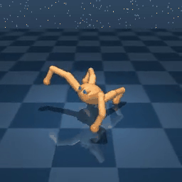
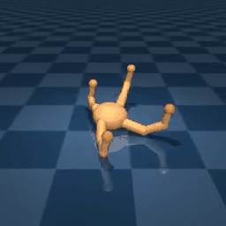
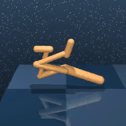
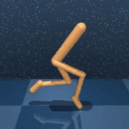

# AMPED: Adaptive Multi-objective Projection for balancing Exploration and skill Diversification

[](https://opensource.org/licenses/MIT)
[](https://arxiv.org/abs/2506.05980)


AMPED (Adaptive Multi-objective Projection for Exploration and skill Diversification) is a skill-based reinforcement learning algorithm designed to explicitly balance exploration and skill diversity. AMPED integrates entropy and RND based exploration with contrastive skill separation, and resolves conflicting learning signals using gradient surgery.

For more information, please see our [project webpage](https://geonwoo.me/amped/).

## 🎥 Demonstrations

<p align="center"><b>AMPED Demonstrations</b></p>

<table>
  <tr>
    <td></td>
    <td></td>
    <td></td>
  </tr>
  <tr>
    <td></td>
    <td></td>
    <td></td>
  </tr>
  <tr>
    <td></td>
    <td></td>
    <td></td>
  </tr>
</table>

## 📖 Installation

Before getting started, make sure the following requirements are met:

- **Conda** (for environment management)
- (Optional, only in case you want to run experiments through gpu) **GPU** with **CUDA 11.1** and **cuDNN 8** installed

```sh
conda env create -f conda_env.yml
```

After the installation ends you can activate your environment with

```sh
conda activate amped
```

## 🚀 Usage

The main implementation of **AMPED** can be found in [`agents/amped.py`](https://github.com/Cho-Geonwoo/amped/blob/main/agent/amped.py).  
Implementations of baseline agents such as APT, BeCL, CeSD, CIC, ComSD, DIAYN, and RND are also available in the directory. The **SAC-based skill selector** is implemented in [`skill_selector/sac.py`](https://github.com/Cho-Geonwoo/amped/blob/main/skill_selector/sac.py).

AMPED supports training agents across various domains and tasks through a **two-stage process**:

1. **Pre-training**: Learn diverse and meaningful skills using unsupervised objectives.

   - Run via `pretrain.py`
   - Pretraining will produce several agent snapshots after training for `100k`, `500k`, `1M`, and `2M` frames and snapshots will be stored in `./models/states/<domain>/<agent>/<seed>/ `. (i.e. the snapshots path is `./models/states/walker/amped/3/ `).

2. **Fine-tuning**: Adapt the pretrained policy to a downstream task using its extrinsic reward.
   - Run via `finetune.py` or `finetunev2.py`
   - Use `finetunev2.py` to enable the skill selector, which dynamically chooses the best skill to execute at each time step.
   - During fine-tuning, the pretrained agent is initialized from a saved snapshot and continues learning in a reward-driven setting.

### Example Usage

```bash
# Pre-train AMPED on walker domain
python pretrain.py agent=amped domain=walker seed=3

# Finetune AMPED on walker_stand task
python finetune.py task=walker_stand obs_type=states agent=amped reward_free=false seed=3 domain=walker snapshot_ts=2000000

# Pre-train APT on jaco domain
python pretrain.py agent=apt domain=jaco seed=100

# Finetune APT on jaco_reach_top_left task
python finetune.py task=jaco_reach_top_left obs_type=states agent=apt reward_free=false seed=100 domain=jaco snapshot_ts=2000000

# Finetune AMPED on walker_stand task with skill selector
python finetunev2.py task=walker_stand obs_type=states agent=amped reward_free=false seed=3 domain=walker snapshot_ts=2000000
```

## 🌍 Available Domains

AMPED supports the following domains and associated tasks:

| **Domain**  | **Tasks**                                                                      |
| ----------- | ------------------------------------------------------------------------------ |
| `walker`    | `stand`, `walk`, `run`, `flip`                                                 |
| `quadruped` | `walk`, `run`, `stand`, `jump`                                                 |
| `jaco`      | `reach_top_left`, `reach_top_right`, `reach_bottom_left`, `reach_bottom_right` |

## 🧠 Available Baselines

We support the following baseline agents:

| **Baseline**                                                                                                                                      |
| ------------------------------------------------------------------------------------------------------------------------------------------------- |
| [`APT`](https://arxiv.org/abs/2103.04551): Behavior From the Void: Unsupervised Active Pre-Training (NeurIPS 2021)                                |
| [`BeCL`](https://proceedings.mlr.press/v202/yang23a/yang23a.pdf): Behavior Contrastive Learning for Unsupervised Skill Discovery (ICML 2023)      |
| [`CeSD`](https://arxiv.org/pdf/2405.16030): Constrained Ensemble Exploration for Unsupervised Skill Discovery (ICML 2024)                         |
| [`CIC`](https://arxiv.org/abs/2202.00161): Contrastive Intrinsic Control for Unsupervised Skill Discovery                                         |
| [`ComSD`](https://arxiv.org/pdf/2309.17203): Balancing Behavioral Quality and Diversity in Unsupervised Skill Discovery (IEEE T-Cybernetics 2025) |
| [`DIAYN`](https://openreview.net/forum?id=H1g0c6NtPB): Diversity is All You Need: Learning Skills without a Reward Function                       |
| [`RND`](https://arxiv.org/abs/1810.12894): Exploration by Random Network Distillation                                                             |

## 📊 Monitoring

Training logs are saved in the `exp_local` directory. To launch TensorBoard, run:

```sh
tensorboard --logdir exp_local
```

For logging with Weights & Biases (wandb):

- Set `use_wandb: true` and provide your WandB API key via the `wandb_key` field in the `config.yaml` file.
- Alternatively, you can enable logging by passing `--use_wandb true` and `--wandb_key <your_wandb_key>` as command-line arguments.

Console output is also provided in this format:

```bash
| train | F: 6000 | S: 3000 | E: 6 | L: 1000 | R: 5.5177 | FPS: 96.7586 | T: 0:00:42
```

Where:

```yaml
F: total number of environment frames
S: total number of agent steps
E: total number of episodes
R: episode return
FPS: training throughput (frames per second)
T: total training time
```

## Misc

- We adopt an agent-specific code structure to avoid unnecessary complexity. Instead of sharing a unified codebase across all agents, we maintain a separate set of files for each agent to improve clarity and modularity.

- Please note that this codebase may not exactly reproduce the results reported in the paper due to potential human errors during code migration. If you observe any discrepancies in performance, feel free to reach out—we’d appreciate your feedback.

## Acknowledgements

This codebase is built on top of the [Unsupervised Reinforcement Learning Benchmark (URLB) codebase](https://github.com/rll-research/url_benchmark).

The implementation of CeSD is adapted from its [CeSD Repository](https://github.com/Baichenjia/CeSD), BeCL from the [BeCL Repository](https://github.com/Rooshy-yang/BeCL), CIC from the [CIC Repository](https://github.com/rll-research/cic), and ComSD is implemented based on the [ComSD Repository](https://github.com/liuxin0824/ComSD).

## License

This project is licensed under the MIT License -- see the [LICENSE](LICENSE) file for details. Note that the repository relies on third-party libraries subject to their respective licenses.

## Citation

```
@article{AMPED,
  title={AMPED: Adaptive Multi-objective Projection for balancing Exploration and skill Diversification},
  author={Cho, Geonwoo and Lee, Jaemoon and Im, Jaegyun and Lee, Subi and Lee, Jihwan and Kim, Sundong},
  journal={arXiv preprint arXiv:2506.05980},
  year={2025}
}
```
